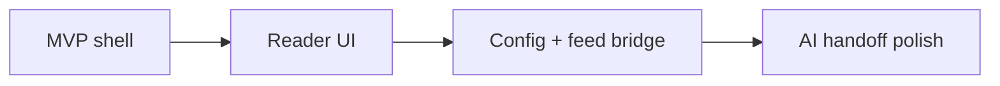

# PLAN

## Slice roadmap

This order keeps the Craft Agents UI integration first, so we can validate the host shape early.
The config and feed bridge lands immediately after, because the page needs live data to feel real.

## Slices
| Slice | Change | Files | Input dependency | Done standard | Estimate |
|---|---|---|---|---|---|
| 1 | Add rss-mold source detection and swap generic source info page for a custom reader page | `apps/electron/src/renderer/components/app-shell/MainContentPanel.tsx`, new reader page/components | Confirm source provider contract | Selecting rss-mold opens custom page shell | 15m |
| 2 | Build article list + reader detail UI with empty/loading/offline states and session handoff actions | new renderer components under `apps/electron/src/renderer/components/rss` | Slice 1 | Page renders realistic reader workflow | 15m |
| 3 | Read the same rss-mold config used by the MCP source and fetch feed payloads through a narrow RPC helper | `apps/electron/src/renderer/lib/rss-mold.ts`, `packages/server-core/src/handlers/rpc/rss.ts`, transport/shared types | Slice 2 | Page can show live feed data without a second UI service | 15m |
| 4 | Polish AI handoff prompts and write README-style setup notes for the local workflow | docs + reader page | Slice 3 | Craft Agents can read, translate, and capture from the same source setup the user already runs | 15m |
