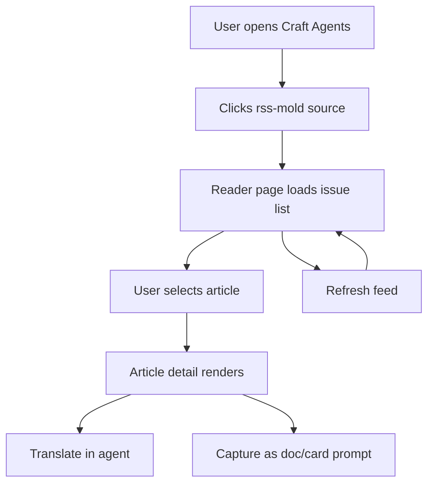
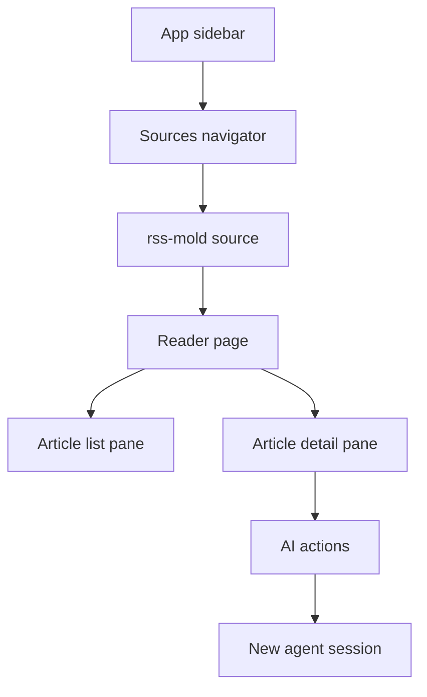

# PRD

## Vision

把私人报纸流长进 Craft Agents

## Target users

- Already use Craft Agents as the main AI workspace
- Read multiple RSS or blog sources every day
- Want article translation and knowledge capture without app-switching

## Must have / Should have / Could have / Won't have

### Must have
- `rss-mold` source can appear under the existing Sources navigator
- Selecting that source opens a reader-native page instead of generic source metadata
- Reader page shows article list and article detail in one workspace
- Article actions can open a new agent session for translation or knowledge extraction
- Existing Craft Agents navigation and session workflows remain unchanged for non-RSS sources

### Should have
- Empty, loading, and config/feed-error states
- Source-level refresh action
- Date grouping and unread-style visual emphasis

### Could have
- Keyboard navigation between articles
- Feed grouping and smart filters
- In-page article translation preview

### Won't have
- Multi-account sync
- iOS or web client parity
- Full NetNewsWire persistence model
- Deep rewrite of the Craft Agents source subsystem

## User flow


The key change is at the source detail layer, not the app shell.
The user path stays consistent with the current Sources navigator, so the new reader feels native instead of bolted on.

## Information architecture or navigation


```text
+----------------------------------------------------------------------------------+
| App sidebar | Sources list | Reader page                                         |
|             |              | +------------------+-------------------------------+ |
| Sessions    | rss-mold     | | Article list     | Reader detail                 | |
| Sources     | github       | | - title          | - title                       | |
| Skills      | linear       | | - source         | - source/date                 | |
|             |              | | - summary        | - content / excerpt           | |
|             |              | |                  | - Translate / Doc / Card      | |
|             |              | +------------------+-------------------------------+ |
+----------------------------------------------------------------------------------+
```

Annotated regions:
1. App sidebar stays untouched so the product still feels like Craft Agents.
2. Sources list remains the selector for which reader or connector is active.
3. Reader page owns only the inside of the detail panel, which keeps the change scoped.
4. AI actions sit beside the article, not hidden in a separate workflow.

## Done standards
| Feature | User-visible result | Evidence |
|---|---|---|
| Source-specific reader page | Clicking `rss-mold` shows a reader workspace, not the generic source info screen | Screenshot of source detail page |
| Article list | User sees multiple articles with title, source, and excerpt | Screenshot of populated list |
| Article detail | Clicking an item updates the reader pane with article details | Screenshot of selected article state |
| AI action handoff | Clicking an action creates or opens a session with a prefilled prompt | Video or screenshot of created session |
| Failure state | If config or feed loading fails, the page explains what is missing and still renders partial results when possible | Screenshot of error state |

## Technical constraints

- Only incremental changes on top of `craft-agents-oss`
- Avoid changes to global source storage or session runtime contracts unless strictly needed
- Keep the new reader behind a source-specific provider check
- Reuse the source's existing `rss-mold` setup, including `RSS_MOLD_CONFIG` or `--config`, on macOS

## Success metrics

- A user can read and act on RSS content without leaving Craft Agents
- Existing non-RSS sources behave exactly as before
- Setup is simple enough to document in a short local README

## Out of scope

- Full unread persistence parity with NetNewsWire
- Feed sync with external accounts
- Article extraction that matches Safari Reader on every site
- Replacing the generic SourceInfo page for all sources
