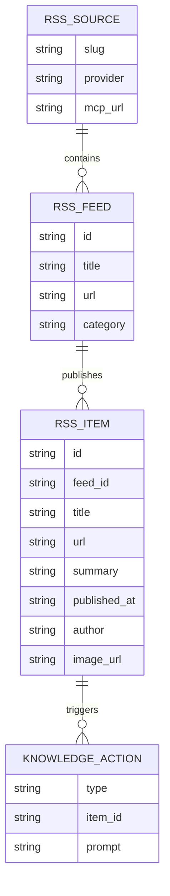
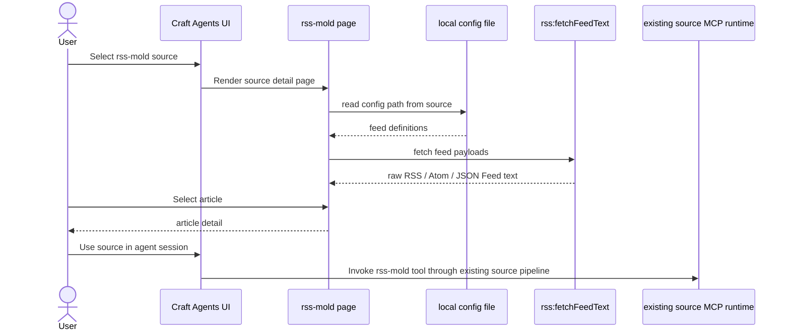

# SPEC

## Data model

The MVP keeps persistence shallow.
Feed config comes from a local JSON file, items are normalized in memory, and actions generate prompts rather than deep document storage.

## API signatures

### Renderer helpers
- `extractRssMoldConfigPath(source: LoadedSource) -> string | null`
  - Reads `RSS_MOLD_CONFIG`, `--config`, or `-c` from the selected source
- `parseRssMoldConfig(rawConfig: string) -> RssMoldFeedDefinition[]`
  - Accepts tolerant JSON with `feeds`, `subscriptions`, `sources`, `groups`, or plain URL arrays
- `parseFeedPayload(feed, text) -> RssMoldArticle[]`
  - Normalizes RSS, Atom, and JSON Feed into one article model

### RPC helper
- `rss:fetchFeedText(url: string) -> string`
  - Input: one `http` or `https` feed URL
  - Output: raw feed payload text for the renderer to parse
  - Guardrails: timeout, payload limit, protocol allowlist

### Existing MCP path
- Agent-side querying remains on the source's existing MCP runtime
- The reader page does not invent a second source contract or separate UI server

## Third-party services

- Public RSS / Atom / JSON Feed URLs
- Existing Craft Agents source plumbing for MCP access

## Environment variables

- `RSS_MOLD_CONFIG`
  - Optional source env var pointing at the local JSON feed config file
- `--config` / `-c`
  - Equivalent command args on the source entry

## Flow or state diagram

The page and MCP flows intentionally share the same source config, but the page only needs one narrow fetch helper.
That is the key move that keeps the host modifications light.

## Security constraints
- Auth:
  No new auth surface is introduced in the MVP
- Input validation:
  Validate config JSON shape, allow only `http` and `https` feed URLs, and never trust feed markup directly
- Secret handling:
  No credentials in source config or renderer
- Permission boundary:
  The custom page may read only the source-linked config file and remote feed payloads through the RPC helper
- Network exposure:
  No extra localhost UI server or LAN listener is added for the reader
- HTML handling:
  Prefer plain text / sanitized excerpts in the renderer; do not inject arbitrary feed HTML with `dangerouslySetInnerHTML`
