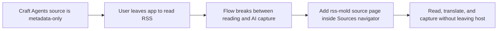
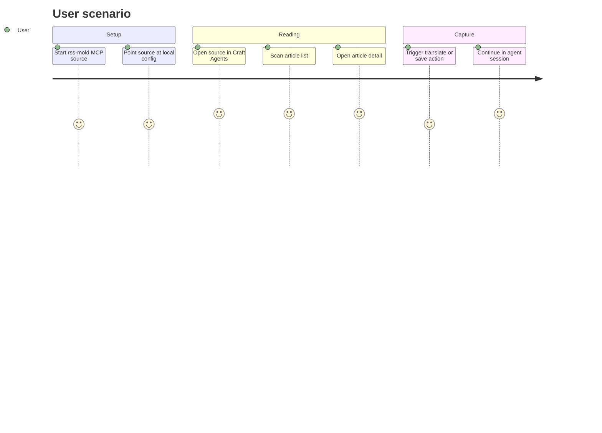

# Research Report

## Core problem
- Who is blocked:
  The user wants NetNewsWire-like reading inside Craft Agents, but Craft Agents currently treats sources as metadata/tool connectors rather than full reader workspaces.
- What they do today:
  They can attach MCP sources to agent sessions, but they cannot browse a feed river, scan headlines, open articles, and trigger AI capture from a reader-native layout.
- Why the current workaround is weak:
  The closest workaround is "open RSS somewhere else, then paste links into chat." That breaks the flow, loses reading state, and makes Craft Agents feel like a second screen instead of the host.

## Competitive scan
| Product | Strength | Weakness | What we should copy or avoid |
|---|---|---|---|
| NetNewsWire | Mature feed workflow, article list + reader rhythm, low-friction unread scanning | Native Apple stack is not portable into Craft Agents | Copy the reader mental model, not the implementation |
| VSCode-RSS / RSS Plus | Proves a reader can live inside a workbench-style app | Plugin-grade UX, weaker than a dedicated reader | Copy the "workbench host + reader pane" idea, avoid plugin feel |
| Craft Agents | Beautiful shell, sources navigator, agent workflow, multi-panel UI | No first-class reader source page today | Keep the shell intact and add a source-native reader page |

## Recommended stack
- Frontend:
  Existing React/Electron renderer in `apps/electron`, with a source-specific detail page for `rss-mold`
- Backend:
  Existing server-core RPC layer plus one narrow helper for feed fetching
- Data:
  Local JSON config + in-memory normalized articles for MVP
- Deployment:
  Run locally on macOS; the user keeps their normal `rss-mold` source setup and the reader reuses its config path

## Main risk
- Risk:
  Craft Agents currently exposes source metadata to the renderer, but not arbitrary source tool execution or resource reads from detail pages.
- Why it matters:
  If the reader page depends on generic MCP calls from the renderer, the implementation would force deeper platform changes.
- Validation plan:
  Keep agent integration and reader UI decoupled: agent uses MCP through the existing source pipeline; renderer reads the same local config and fetches raw feed text through a dedicated RPC helper.

## Visual 1: Problem to solution

This keeps Craft Agents as the host instead of inventing a second app shell.
The critical boundary is that the new reader is attached to one source type, not the whole navigation system.
That lets us stay incremental and avoid destabilizing the existing session flow.

## Visual 2: User scenario map

The first success is not "all of NetNewsWire is rebuilt."
The first success is that the user can live inside Craft Agents and still feel like they have a native newspaper workspace.

## Validation conclusion
- Build / do not build:
  Build
- Why now:
  The host app already has the navigation shell, source registry, and session entry points needed for a thin vertical slice.
- Scope guardrails:
  Only add an `rss-mold` source page and one feed-fetch helper for MVP.
  Do not refactor the global source abstraction.
  Do not attempt multi-account sync or full NetNewsWire parity in the first slice.
